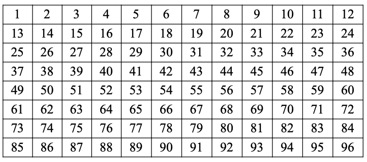

# map_hard_tile

<Prototype>int map_hard_tile(int tile_position, int hard_tile_index[-1])</Prototype>

`map_hard_tile()` gets or sets the hardness tile for the tile at position `tile_position`.

The `tile_position` refers to a tile on the current screen. Tile 1 is in the upper left-hand corner, and the position counts left-to-right until Tile 96 at the bottom-right corner.

The `hard_tile_index` will be in the range 1 to 799. `draw_hard_map()` is required in order to draw this hardness.
