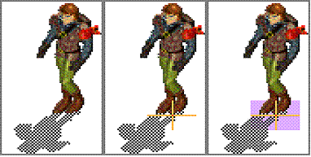

# Graphics

The `dink.ini` file is used to load graphics. To add new graphics to a D-Mod you will (probably) have to modify this file, unless you rename your new graphics to match some original graphics file names and replicate the file/folder structure of those original files.

Graphics are referenced according to two numbers: A graphic sequence number and then a frame number. Each graphic sequence can have several frames, and each frame (slot) holds one bmp file. <br>
The maximum frames per sequence varies between Dink Engines:
<VersionInfo dink="" freedink= "">1-50</VersionInfo>
<br>
<VersionInfo dinkhd="" yedink="">1-99</VersionInfo>

It is possible to go over the limit of frames, but you cannot play more than the frame limit in an animated sequence, and exceeding the limit can cause serious problems when playing the game.


<VersionInfo dink="">

The ini lines should be at most 80 characters long. Longer lines will be truncated.

</VersionInfo>

## load_sequence

The two basic commands used to load graphics are:

```txt
load_sequence_now [path]/[filename] [seq] [delay] [X coord] [Y coord] [left] [top] [right] [bottom]
load_sequence [path]/[filename] [seq] [delay] [X coord] [Y coord] [left] [top] [right] [bottom]
```

`load_sequence_now` puts those graphics straight into memory and is mainly used for the graphics associated with Dink and the status bar, but also include the burning pine tree – as it's nice to have that tree burn as soon as it's hit by a fireball.

`load_sequence` makes those graphics available to the Dink Engine or the map editor.

<span id="load_sequence-auto-params">Setting the `X coord`, `Y coord`, `right`, or `bottom` paramaters individually to `0` or a negative number will make that particular paramater be ignored and the engine will use the default internal algorithm to calculate it. In the case of `right` it will apply the default algorithm for both left and right even if the other is set. It also does this for top and bottom.</span>

The algorithms the Dink Engine uses to generate the depth dot position and hardbox when no paramaters are provided are:<br>
**Depth dot X position:** image width - (image width / 2) - (image width / 6)<br>
**Depth dot Y position:** image height - (image height / 4) - (image height / 30)<br>
**Hardbox left side:** 0 - (image width / 4)<br>
**Hardbox right side:** 0 + (image width / 4)<br>
**Hardbox top side:** 0 - (image height / 10)<br>
**Hardbox bottom side:** 0 + (image height / 10)<br>
<br>
::: tip Note
load_sequence bug

If a sprite loaded with load_sequence is added using create_sprite(), it might be created with the wrong hardbox. This bug can be avoided by pre-loading the sequence.
:::

### `[path]/`

This is the folder structure needed to locate the bmp file. If you only have a few new graphics you could place them all in the `graphics` folder together, rather than break them up into sub-folders, but it is recommended against this if you have more than one type of graphic, and especially if you have an animated series like a new savebot, or teleport machine. Just create a new folder for each group of bmp files in the `graphics` folder and place the relevant bmp files in that new folder.

### `[filename]`

This is the name of the bmp file. If you have an animated series, then label the files `filenameXX.bmp` where XX are sequential numbers from 01 to 50. Of note is the default format of using `filename-XX.bmp` while the `-` is optional, it does make for easy reading of file names, although now your name is down to 5 characters in length.

### `[seq]`

This is the Sequence number that your new graphics are loaded into.<br>
The sequence range varies between Dink Engines:
<VersionInfo dink="" freedink= "">1-999</VersionInfo><br>
<VersionInfo dinkhd="">1-30000</VersionInfo><br>
<VersionInfo yedink="">1-35000</VersionInfo>

Some sequence numbers are dedicated to various graphics needed to run the map editor. For sprites that walk in 4 or 8 directions the sequences are grouped in a base of 10, and the [sp_base_walk()](../functions/sp-base-walk.md), [sp_base_attack()](../functions/sp-base-attack.md), [sp_base_idle()](../functions/sp-base-idle.md), and [sp_base_death()](../functions/sp-base-death.md) commands can access the correct graphics by if you adhere to the following convention:

| Base seq number | Direction  |
|-----------------|------------|
| 1               | south-west |
| 2               | south      |
| 3               | south-east |
| 4               | west       |
| 6               | east       |
| 7               | north-west |
| 8               | north      |
| 9               | north-east |

Therefore the base sequence of 70 (which is the base sequence of Dink walking) is loaded in `dink.ini` as:

```txt
load_sequence_now graphics\dink\walk\ds-w1- 71 43 38 72 -14 -9 14 9
load_sequence_now graphics\dink\walk\ds-w2- 72 43 37 69 -13 -9 13 9
load_sequence_now graphics\dink\walk\ds-w3- 73 43 38 72 -14 -9 14 9
load_sequence_now graphics\dink\walk\ds-w4- 74 43 38 72 -12 -9 12 9
load_sequence_now graphics\dink\walk\ds-w6- 76 43 38 72 -13 -9 13 9
load_sequence_now graphics\dink\walk\ds-w7- 77 43 38 72 -12 -10 12 10
load_sequence_now graphics\dink\walk\ds-w8- 78 43 37 69 -13 -9 13 9
load_sequence_now graphics\dink\walk\ds-w9- 79 43 38 72 -14 -9 14 9
```

### `[delay]`

This number specifies the approximate delay between displaying one bmp file and the next. Units are milliseconds. In the example above, Dink walking has a "43" millisecond delay between each bmp file. See [sp_frame_delay()](../functions/sp-frame-delay.md) for more information.
You do not have to set a delay - you can leave this value out and the Dink Engine will still read all the other paramaters correctly, leaving out the delay.

### `[X coord]` `[Y coord]`

These two numbers are used to set the depth dot for the bmp. This is important to get right so that Dink and other sprites walk around it in a somewhat realistic manner. The two numbers are referenced from the top left hand corner of the bmp file in terms of pixels.
Note that negative values will not work.

```txt
load_sequence_now graphics\dink\walk\ds-w1- 71 43 38 72 -14 -9 14 9
```

In this case the depth dot is 38 pixels across from the top left hand corner and then 72 pixels down.

### `[left]` `[top]` `[right]` `[bottom]`

These last four numbers at the end of the `load` command are the X and Y coordinates for the top left hand corner of the hardness box for the bmp and then the X and Y coordinates of the bottom right hand corner of the hardness box, all relative to the depth dot (see above).
Note: The X and Y co-ordinates used in game for the bottom right hand corner, will be your specified value *minus* 1. It's too small to notice in almost any situation, but if you're requiring a dead-accurate hardbox for some reason, simply add one to the X and Y coordinates of the bottom right hand corner.

```txt
load_sequence_now graphics\dink\walk\ds-w1- 71 43 38 72
```

Here is an example bmp of Dink walking in direction "1" to help illustrate this – this image is enlarged but is scaled proportionally from the original bmp graphic:



The first image is the normal graphic, the second image has a red dot marked for the depth dot (orange lines pin pointing it) and the final image has the dimensions of the hardness box (pink). I've also placed a 1 pixel dot at the top left hand corner to mark the refernece point from which the depth dot is calculated. Hardness box is calculated from the red depth dot.

You can see a similar hardness box mid game by activating the debug mode (pressing the <kbd>ALT-D</kbd> key combination while playing).

## Loading graphics on the fly

You need to use the [init()](../functions/init.md) command to load new graphics during a game.

<VersionInfo dink="1.07">
It is recommended that you load the graphics which have the most bmp files per sequence first.
</VersionInfo>

Sample code to load new graphics on the fly – from `item-sw1.c` original source file:

```c
// excerpt from item-sw1.c
void arm(void)
{
    //sword range
    sp_distance(1, 50);
    sp_range(1, 40);
    //sword strength added
    &strength += 4;
    sp_attack_hit_sound(1, 10);
    sp_attack_hit_sound_speed(1, 8000);

    init("load_sequence_now graphics\dink\sword\walk\d-sw1- 71 43 64 69 -14 -10 14 10");
    init("load_sequence_now graphics\dink\sword\walk\d-sw2- 72 43 35 70 -21 -10 19 10");
    init("load_sequence_now graphics\dink\sword\walk\d-sw3- 73 43 28 69 -13 -9 13 9");
    init("load_sequence_now graphics\dink\sword\walk\d-sw4- 74 43 66 75 -14 -12 20 12");
    init("load_sequence_now graphics\dink\sword\walk\d-sw6- 76 43 27 69 -23 -10 23 10");
    init("load_sequence_now graphics\dink\sword\walk\d-sw7- 77 43 38 94 -20 -10 20 10");
    init("load_sequence_now graphics\dink\sword\walk\d-sw8- 78 43 30 96 -15 -12 15 12");
    init("load_sequence_now graphics\dink\sword\walk\d-sw9- 79 43 31 80 -13 -9 13 9");
    init("load_sequence_now graphics\dink\sword\idle\d-si2- 12 250 74 73 -17 -12 16 9");
    init("load_sequence_now graphics\dink\sword\idle\d-si4- 14 250 57 103 -11 -12 16 10");
    init("load_sequence_now graphics\dink\sword\idle\d-si6- 16 250 30 92 -15 -9 11 9");
    init("load_sequence_now graphics\dink\sword\idle\d-si8- 18 250 35 106 -15 -12 15 9");
    init("load_sequence_now graphics\dink\sword\hit\d-sa2- 102 75 52 92 -23 -12 24 11");
    init("load_sequence_now graphics\dink\sword\hit\d-sa4- 104 75 74 90 -23 -13 23 14"); 
    init("load_sequence_now graphics\dink\sword\hit\d-sa6- 106 75 33 92 -18 -14 18 10");
    init("load_sequence_now graphics\dink\sword\hit\d-sa8- 108 75 46 109 -17 -16 17 10");
    int &basehit;
}
```

## Additional parameters

Other additional parameters to the `load_sequence` command include: `NOTANIM`; `BLACK`; `LEFTALIGN`.

### `NOTANIM`

Normally, when a sequence does not provide depth dot or hardbox, the engine generates the depth dot hardbox for the first frame [as described above](#load_sequence-auto-params) and then uses that hardbox for every frame. With `NOTANIM`, the hardbox and depth dot are generated individually for each frame. This causes frames with differently sized images to have different hardboxes.

Note that `NOTANIM` does not prevent animating the sequence.

Example of the `NOTANIM` is used to load all the (static) tree bmps

```txt
load_sequence graphics\lands\trees\tree- 32 NOTANIM
```

### `BLACK`

This is used to specify that the bmps will use the black pixels as transparency, instead of the default white pixels.

Example of the use of this parameter from the original `dink.ini`:

```txt
load_sequence_now graphics\inter\status\stat- 180 BLACK
```

Can you have an animated bmp sequence with `BLACK` as transparency? Yes. While the main game does not use it, you can add depth dot and hardness after the BLACK:

```txt
load_sequence graphics\my\fancy\thing- 851 BLACK 67 86 -21 -12 21 12
```

### `LEFTALIGN`

Finally, `LEFTALIGN` is used in loading graphics used to display numbers and the health bar in the stats area of the screen.

## set_frame_frame

This command has two uses.

The first is to assign a graphics sequence slot a bmp file that has already been loaded into another graphic sequence slot. Examples of this include Dink's idling animation:

```txt
set_frame_frame 12 5 12 3
set_frame_frame 12 6 12 2
```

The first number is the new graphic sequence.<br>
The second number is the new frame.<br>
The third number is the source graphic sequence.<br>
The fourth number is the source graphic frame.

You must also set the frame delay for these "newly created" bmps (see command below).

The second use for `set_frame_frame` is to set an animation to repeat itself, and the only example I can find is the headless duck:

```txt
//lets modify the duck anim so it repeats by itself
set_frame_frame 111 5 -1
set_frame_frame 113 5 -1
set_frame_frame 117 5 -1
set_frame_frame 119 5 -1 
```

The first number is the graphic sequence, the second number the total bmp files in the sequence and the "-1" parameter sets the sequence into repeat by itself.

## set_frame_delay

This command specifies the delay between playing the frame (graphic slot) specified and the next. According to the comments in the original `dink.ini` to delay the 3rd frame in sequence number 102 which is the default sword attack (ie make it hold for longer) you would use

```txt
set_frame_delay 102 2 100
```

The first number is the sequence.<br>
The second number is the frame.<br>
The third number is the delay

I've tested this command and it actually holds the frame number up on screen for the specified time. If you want you can change the 100 to something like 800 to get a noticable freeze effect for an attack.

## set_frame_special

This command is used to indicate which frame in the graphic sequence can attack Dink or another sprite. Unless this is specificed a sprite won't do any damage based on its [sp_strength()](../functions/sp-strength.md) attribute when attacking Dink. This command is also used to specify which frames in Dink's attack sequence will impact on an enemy.

Without specifying which frame is "special" you can't hear the sound of the attack (that is the sound specified by [sp_attack_hit_sound()](../functions/sp-attack-hit-sound.md) command). Note that the graphics used to cast magic, don't have `set_frame_special` and thus make no sound when Dink casts magic and is close enough to "physically" hit the sprite.

Example of the Dink hitting:

```txt
//set which frame can 'hit'
set_frame_special 102 3 1
set_frame_special 104 3 1
set_frame_special 106 3 1
set_frame_special 108 3 1
```

Example of the grey bonca hitting:

```txt
set_frame_special 594 5 1
set_frame_special 598 5 1
set_frame_special 592 5 1
set_frame_special 596 5 1
```

First number is the graphic sequence.<br>
Second number is the frame.<br>
Third number (1) sets that frame to the "hit" status. This "hit attribute" is a boolean parameter – either 0 or 1.

What is strange with the Dink hitting with a fist and/or the sword is that the bmp graphic for the hit with a first is the arm out stretched which makes sense, but the graphic in frame (slot) number 3 of the sword attack is of the sword being held over Dink's head. So Dink is really doing damage before the sword falls.

## set_sprite_info

`set_sprite_info` is used to define the depth dot and hardness box of an individual sprite. These are used when you load a group of sprites which are all different shapes and sizes and (usually) not going to be animated into one sequence. This information is generated by the DinkEdit program, by selecting the sprite and going into sprite edit mode <kbd>E</kbd> key.

```txt
//tree alignments
SET_SPRITE_INFO 32 11 30 24 -32 -22 20 3
```

The first number (32) is the graphic sequence number.<br>
The second number (11) is the frame number (of the bmp file).<br>
The next two numbers (30 24) define the depth dot relative to the top left corner of the bmp file.<br>
The last four numbers (-32 -22 20 3) define the hardness box relative to the depth dot.

## Limits on ini commands
Things to note about the `set_sprite_info`, `set_frame_frame`, `set_frame_delay`, `set_frame_special` commands, is that there is a limit on the amount you can have, except in Dink Smallwood HD, which does not have a limit:
<VersionInfo dink="1.07">599</VersionInfo><br>
<VersionInfo dink="" freedink= "">999</VersionInfo><br>
<VersionInfo yedink="">1999</VersionInfo>

After that number is passed, no new lines are read. To make matters worse you can have redundant lines in which you've (for example) set the sprite info once, then gone back and changed it again. There is a line for both occurances in the `dink.ini` file (but the last one is the one that is used) and so for one sprite you can waste more than 1 of the `set_sprite_info` lines allocated.

Additionally `load_sequence_now` lines count against this limit although passing the limit does not prevent them from being executed.